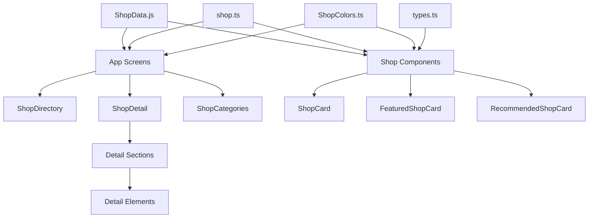

# Shop Module - Comprehensive File Structure Mapping

This document provides a detailed mapping of all files and components related to the **Shop Module** in the Naga Venture Tourist App.

## Table of Contents
- [Overview](#overview)
- [Core Directory Structure](#core-directory-structure)
- [Application Screens](#application-screens)
- [Reusable Components](#reusable-components)
- [Shop Detail Components](#shop-detail-components)
- [Data Layer](#data-layer)
- [Type Definitions](#type-definitions)
- [Constants & Styling](#constants--styling)
- [File Dependencies](#file-dependencies)
- [Component Hierarchy](#component-hierarchy)

---

## Overview

The Shop Module enables tourists to discover, browse, and interact with local businesses in Naga City. It includes features for:
- Browsing featured and recommended shops
- Exploring shop categories and subcategories
- Viewing detailed shop information
- Reading and writing reviews
- Viewing promotions and special offers
- Searching and filtering shops

---

## Core Directory Structure

```
Shop Module Files
├── app/TouristApp/(tabs)/(home)/(shops)/          # Screen-level components
│   ├── (categories)/
│   ├── (details)/
│   ├── (subcategory)/
│   └── Screen files...
├── components/shops/                               # Reusable shop components
│   ├── details/
│   │   ├── elements/                              # Detail page UI elements
│   │   └── sections/                              # Detail page sections
│   └── Component files...
├── Controller/                                     # Data controllers
├── types/                                         # TypeScript definitions
└── constants/                                     # Colors and styling
```

---

## Application Screens

### Main Shop Screens
**Location:** `app/TouristApp/(tabs)/(home)/(shops)/`

| File | Purpose | Key Features |
|------|---------|--------------|
| `index.tsx` | Main shop directory page | - Shop categories<br>- Featured shops carousel<br>- Search functionality<br>- Special offers |
| `index.web.tsx` | Web-specific shop directory | Web-optimized layout |
| `_layout.tsx` | Shop section layout wrapper | Navigation structure |
| `FeaturedShops.tsx` | Featured shops grid view | - Grid layout with 2 columns<br>- Pull-to-refresh<br>- Loading states |
| `RecommendedShops.tsx` | Recommended shops listing | Personalized shop recommendations |
| `AllCategories.tsx` | Complete category listing | All available shop categories |

### Dynamic Routes

| File | Purpose | Parameters | Description |
|------|---------|------------|-------------|
| `(categories)/[category].tsx` | Category-specific shop listing | `category` | Shows all shops in a specific category |
| `(subcategory)/[subcategoryId].tsx` | Subcategory shop listing | `subcategoryId` | Shows shops in a subcategory |
| `(details)/[shopId].tsx` | Individual shop detail page | `shopId` | Complete shop information and features |

---

## Reusable Components

### Main Shop Components
**Location:** `components/shops/`

| Component | File | Purpose | Props Interface |
|-----------|------|---------|-----------------|
| **ShopDirectory** | `ShopDirectory.tsx` | Main shop browsing interface | `ShopDirectoryProps` |
| **ShopCard** | `ShopCard.tsx` | Basic shop card display | `ShopCardProps` |
| **FeaturedShopCard** | `FeaturedShopCard.tsx` | Enhanced card for featured shops | Custom props |
| **RecommendedShopCard** | `RecommendedShopCard.tsx` | Card for recommended shops | Custom props |
| **DiscoverMoreShopCard** | `DiscoverMoreShopCard.tsx` | Card for discovery section | Custom props |

### Specialized Components

| Component | File | Purpose | Key Features |
|-----------|------|---------|--------------|
| **ShopCarousel** | `ShopCarousel.tsx` | Horizontal shop scrolling | - Horizontal FlatList<br>- View all button<br>- Custom spacing |
| **ShopCategories** | `ShopCategories.tsx` | Category grid display | - Icon-based categories<br>- Horizontal scroll<br>- Category navigation |
| **ShopList** | `ShopList.tsx` | Flexible shop listing | - Grid/List/Horizontal modes<br>- Customizable layout<br>- Empty states |
| **ShopSearch** | `ShopSearch.tsx` | Search functionality | - Real-time search<br>- Search suggestions<br>- Filter integration |
| **ShopCategoryPage** | `ShopCategoryPage.tsx` | Category page template | - Category-specific layout<br>- Shop filtering<br>- Statistics display |
| **DiscoverMoreShopList** | `DiscoverMoreShopList.tsx` | Discovery shop listing | Vertical list for discovery |
| **SpecialOfferCard** | `SpecialOfferCard.tsx` | Promotional content display | Special offers and promotions |

### Main Shop Detail Component

| Component | File | Purpose | Key Features |
|-----------|------|---------|--------------|
| **ShopDetail** | `ShopDetail.tsx` | Complete shop detail view | - Scrollable content<br>- Collapsible header<br>- Section management<br>- Modal handling |

---

## Shop Detail Components

### Detail Sections
**Location:** `components/shops/details/sections/`

| Section | File | Purpose | Content |
|---------|------|---------|---------|
| **Info Section** | `ShopDetailInfoSection.tsx` | Basic shop information | - Business hours<br>- Contact info<br>- Amenities<br>- Location map |
| **Menu Section** | `ShopDetailMenuSection.tsx` | Shop menu/services | - Menu categories<br>- Item cards<br>- Pricing<br>- Availability |
| **Photos Section** | `ShopDetailPhotosSection.tsx` | Image gallery | - Photo grid<br>- Gallery modal<br>- Image captions |
| **Promotions Section** | `ShopDetailPromotionsSection.tsx` | Active promotions | - Promotion cards<br>- Terms display<br>- Validity dates |
| **Reviews Section** | `ShopDetailReviewsSection.tsx` | Customer reviews | - Review listing<br>- Rating breakdown<br>- Write review modal |

**Index File:** `sections/index.ts` - Exports all section components

### Detail Elements
**Location:** `components/shops/details/elements/`

| Element | File | Purpose | Functionality |
|---------|------|---------|---------------|
| **Amenity Grid** | `ShopDetailAmenityGrid.tsx` | Display shop amenities | Grid layout of amenities with icons |
| **Business Hours** | `ShopDetailBusinessHours.tsx` | Operating hours display | - Weekly schedule<br>- Current status<br>- Special hours |
| **Contact Info** | `ShopDetailContactInfo.tsx` | Contact details | - Phone numbers<br>- Email<br>- Social links |
| **Map Preview** | `ShopDetailMapPreview.tsx` | Location map | Interactive map component |
| **Menu Item Card** | `ShopDetailMenuItemCard.tsx` | Individual menu items | - Item details<br>- Pricing<br>- Images<br>- Tags |
| **Photo Gallery** | `ShopDetailPhotoGallery.tsx` | Image grid | Photo browsing interface |
| **Promotion Card** | `ShopDetailPromotionCard.tsx` | Promotion display | Individual promotion details |
| **Rating Breakdown** | `ShopDetailRatingBreakdown.tsx` | Rating statistics | - Star distribution<br>- Rating analytics |
| **Review Card** | `ShopDetailReviewCard.tsx` | Individual reviews | - User reviews<br>- Rating display<br>- Helpful votes |

### Modal Components

| Modal | File | Purpose | Functionality |
|-------|------|---------|---------------|
| **Photo Gallery Modal** | `PhotoGalleryModal.tsx` | Full-screen image viewing | Image carousel with captions |
| **Write Review Modal** | `WriteReviewModal.tsx` | Review submission | - Rating input<br>- Text review<br>- Form validation |
| **Review Submitted Modal** | `ReviewSubmittedModal.tsx` | Submission confirmation | Success feedback |
| **Review Validation Modal** | `ReviewValidationModal.tsx` | Input validation errors | Error handling and feedback |

**Index File:** `elements/index.tsx` - Exports all element components

---

## Data Layer

### Shop Data Controller
**Location:** `Controller/`

| File | Purpose | Content |
|------|---------|---------|
| `ShopData.js` | Complete shop data management | - **shopsData**: Detailed shop objects (5 shops)<br>- **ShopsData**: Array format for compatibility<br>- **featuredShops**: Curated featured selections<br>- **recommendedShops**: Recommendation data<br>- **discoverMoreShops**: Discovery content<br>- **categories**: Shop categories with subcategories<br>- **specialOffersData**: Promotional content |

#### Data Structure Overview
- **Individual Shop Objects** (1-5): Complete business profiles
- **Shop Categories**: Hierarchical category system
- **Special Offers**: Promotional campaigns
- **Featured Collections**: Curated shop selections

---

## Type Definitions

### TypeScript Interfaces
**Location:** `types/`

| File | Purpose | Key Interfaces |
|------|---------|----------------|
| `shop.ts` | Complete shop type system | - `ShopData`: Main shop interface<br>- `ShopLocation`: Geographic data<br>- `ShopBusinessHours`: Operating schedule<br>- `ShopReview`: Review structure<br>- `ShopMenuItem`: Menu/service items<br>- `ShopPromotion`: Promotional offers<br>- `ShopGallery`: Image gallery items<br>- `ShopSocialLinks`: Social media links |

### Component Props Types
**Location:** `components/shops/`

| File | Purpose | Interfaces |
|------|---------|------------|
| `types.ts` | Component prop definitions | - `ShopCardProps`<br>- `ShopListProps`<br>- `ShopSearchProps`<br>- `ShopCarouselProps` |

---

## Constants & Styling

### Color System
**Location:** `constants/`

| File | Purpose | Color Categories |
|------|---------|------------------|
| `ShopColors.ts` | Shop module color palette | - **Primary Colors**: Brand colors<br>- **Background Colors**: Card and page backgrounds<br>- **Text Colors**: Typography hierarchy<br>- **Border Colors**: Dividers and outlines<br>- **Status Colors**: Success, error, warning<br>- **Interactive Colors**: Active states |

#### Color Usage
- Consistent across all shop components
- No dark/light mode variations
- Optimized for accessibility

### Component Exports
**Location:** `components/shops/`

| File | Purpose |
|------|---------|
| `index.ts` | Central export hub for all shop components and types |

---

## File Dependencies

### Import Relationships



### Key Dependencies
1. **Data Flow**: `ShopData.js` → Components → Screens
2. **Type Safety**: `shop.ts` + `types.ts` → All components
3. **Styling**: `ShopColors.ts` → All visual components
4. **Navigation**: Expo Router → Screen components
5. **UI Components**: Expo/React Native → All components

---

## Component Hierarchy

### Screen Level
```
ShopDirectory (Main)
├── ShopSearch
├── ShopCarousel (Featured)
├── ShopCategories
├── SpecialOfferCard
├── RecommendedShopCard (List)
└── DiscoverMoreShopList
    └── DiscoverMoreShopCard
```

### Detail Page
```
ShopDetail
├── ShopDetailInfoSection
│   ├── ShopDetailBusinessHours
│   ├── ShopDetailContactInfo
│   ├── ShopDetailAmenityGrid
│   └── ShopDetailMapPreview
├── ShopDetailMenuSection
│   └── ShopDetailMenuItemCard
├── ShopDetailPhotosSection
│   ├── ShopDetailPhotoGallery
│   └── PhotoGalleryModal
├── ShopDetailPromotionsSection
│   └── ShopDetailPromotionCard
└── ShopDetailReviewsSection
    ├── ShopDetailRatingBreakdown
    ├── ShopDetailReviewCard
    └── WriteReviewModal
```

### Card Components
```
ShopCard (Base)
├── FeaturedShopCard (Enhanced)
├── RecommendedShopCard (Horizontal)
└── DiscoverMoreShopCard (Discovery)
```

---

## Development Notes

### File Naming Conventions
- **PascalCase**: All React components
- **camelCase**: Utility files and data
- **kebab-case**: Not used in this module
- **Descriptive**: Clear purpose in naming

### Code Organization
- **Separation of Concerns**: UI, Data, Types separated
- **Reusability**: Shared components extracted
- **Modularity**: Features broken into focused components
- **Type Safety**: Comprehensive TypeScript coverage

### Performance Considerations
- **Lazy Loading**: Image loading optimization
- **List Virtualization**: FlatList for large data sets
- **Memoization**: React.memo for card components
- **Code Splitting**: Modal components separated

---

*Last Updated: December 2024*
*Total Shop Module Files: 50+ files*
*Lines of Code: ~8000+ lines*

This documentation serves as a complete reference for the Shop Module architecture and can be used for development, maintenance, and onboarding new team members.
